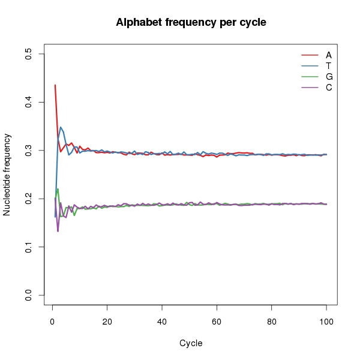
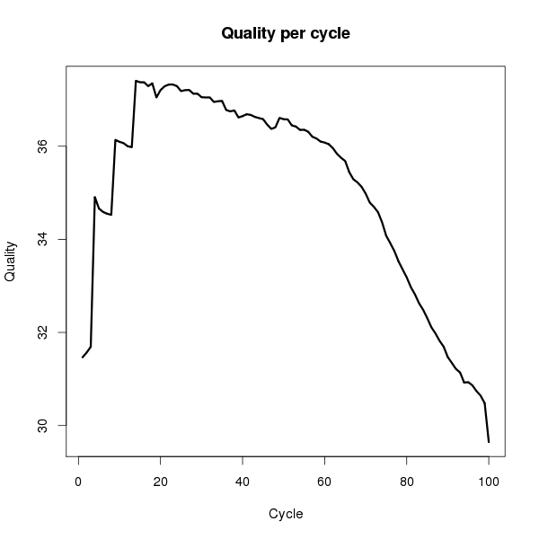
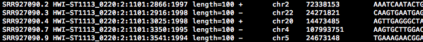

## Introduction

Today we will

- Explore high-throughput sequencing files (fastq files)
- Learn some basic but useful commands in Linux 
- Read in the fastq files in R and use the package **ShortRead** to filter reads out
- Align the reads to a reference genome using **bowtie**

Thanks to Leonardo Collado Torres; my slides are largely inspired by his slides that you can be found at 

http://www.biostat.jhsph.edu/~lcollado/PDCB-HTS.html


## Tip of the day
```sh
curl ftp://path/file.txt.gz | gunzip -cd | head
```

## Starting
First step: log into the cluster using **ssh**:
```sh 
ssh jfortin@jhpce01.jhsph.edu
```
Second step: log into a node
```sh
qrsh -l mem_free=5G,h_vmem=6G
```
Third step: copy fastq file to your directory
```sh
cp /home/student/jfortin/example_2.fastq /home/student/yourname
```
We will work with the first 250,000 reads from a Hi-C Experiment stored in a **fastq** file. 

## ShortRead Package
What does a **fastq** file look like?


The **ShortRead** package in Bioconductor is very useful to explore the quality of the reads. The package is already installed on the cluster.
```{r, eval=FALSE}
library(ShortRead)
dir <- "/home/student/jfortin"
reads <- readFastq(dir, pattern = ".fastq")
```

```{r, echo=FALSE, warning=FALSE, message=FALSE}
library(ShortRead)
dir <- "~/Desktop"
reads <- readFastq(dir, pattern = ".fastq")
```

## Alphabet by cycle
Counting the occurence of each nucleotide for each cycle can inform us about potential technical bias. 
```{r, eval=TRUE}
abc <- alphabetByCycle(sread(reads),
          alphabet = c("A", "T", "G","C", "N"))
# To calculate the proportions:
abc <- abc/colSums(abc)
data.abc <- as.data.frame(abc)
```

## To plot the alphabet proportion :

```{r, eval=FALSE}

plot(1:100, data.abc[1,], type="l", col=1, 
     ylim=c(0,0.5),lwd=3, 
     main="Alphabet frequency per cycle", 
     xlab="Cycle",
     ylab="Nucleotide frequency")

for (i in 2:4){
  lines(1:100, data.abc[i,], col=i,lwd=3)
}

legend("topright", rownames(data.abc)[1:4], 
       col=1:4, lty=1, lwd=2, bty="n")
```

```{r, eval=FALSE, echo=FALSE}
library(RColorBrewer)
palette(brewer.pal(8, "Dark2"))
jpeg("Figure1.jpg", quality=100, width=600, height=600, pointsize=15)
plot(1:100, data.abc[1,], type="l", col=1, ylim=c(0,0.5),lwd=3, main="Alphabet frequency per cycle", xlab="Cycle",ylab="Nucleotide frequency")
for (i in 2:4){
  lines(1:100, data.abc[i,], col=i,lwd=3)
}
legend("topright", rownames(data.abc)[1:4], col=1:4, lty=1, lwd=2, bty="n")
dev.off()
```

## Alphabet per cycle



## Quality matrix


```{r,eval=TRUE}
quality.matrix <- as(quality(reads), "matrix")
quality.matrix[1:5, 1:5]
```
Columns are cycles (100) and rows are reads (250,000)
```{r, eval=FALSE}
# For each cycle we take the average quality score:
mean.quality <- colMeans(quality.matrix)
plot(1:100, mean.quality, type="l",main="Quality per cycle",
     xlab="Cycle",ylab="Quality", lwd=3)
```


```{r, eval=FALSE, echo=FALSE}
mean.quality <- colMeans(quality.matrix)
jpeg("Figure2.jpg", quality=100, width=600, height=600, pointsize=15)
plot(1:100, mean.quality, type="l",main="Quality per cycle", xlab="Cycle",ylab="Quality", lwd=3)
dev.off()
```


## Quality per cycle

What do you observe?

```{r, echo=FALSE}
mean.quality <- colMeans(quality.matrix)
```
## Trimming
```{r}
mean.quality
```

## Trimming
Let's trim the first bases that have poor quality, and the end of the reads as well:
```{r}
shortreads <- narrow(reads, start = 14,
                     end = 61)
```
Now the reads have length 48 

## Retained bases

```{r, echo=FALSE}
plot(1:100, mean.quality, type="l",main="Quality per cycle",
     xlab="Cycle",ylab="Quality", lwd=1, lty=3)
lines(14:61,mean.quality[14:61], lty=1, lwd=3)
```

## Bowtie
We use **bowtie**, installed on the cluster to align the reads to the reference human genome. Bowtie has many many options. (Typing **bowtie** in the command line will return you the main functions). For instance, 
```sh
-5 13
```
will trim the first 13 bases from the reads.
```sh
-3 39
```
will trim the last 39 bases from the reads.
```sh
-m 1
```
will suppress reads with more than 1 reportable alignment

##To align the reads
We need to specify 3 more things:

- The genome to which we want to align to. In our case we are going to align to the human genome, hg19
- The **fastq** file name (example_2.fastq)
- The output file name (example_2.bam)
First, we need to load bowtie:
```sh
module load bowtie
```
and then typing the following command in one line
```sh
bowtie -5 13 -3 39 -m 1 hg19 example_2.fastq example_2.bam
```
produces the file **example_2.bam** that contains the alignments.

## BAM file



The output is big. Most of the time we are only interested in the strand, the chromosome information and the position.  The option 
```sh
--suppress 5,6,7,8
```
will omit the columns 1,5,6,7,8 in the ouput so that you will only get the desired columns:


## Parallel jobs
Aligning reads can take a long time; **Bowtie** has the option of using multiple cores. First, you need to request multiple nodes when using **qrsh** or **qsub**:
```sh
qrsh -pe local 5 -l mem_free=100G,h_vmem= 26
```
is what you need to request 5 nodes. To specify **h_vmem**, you need to divide **mem_free** by the number of nodes and add a bit. Now, in **bowtie**, add the option **-p**:
```sh
bowtie -p 5 ... 
```